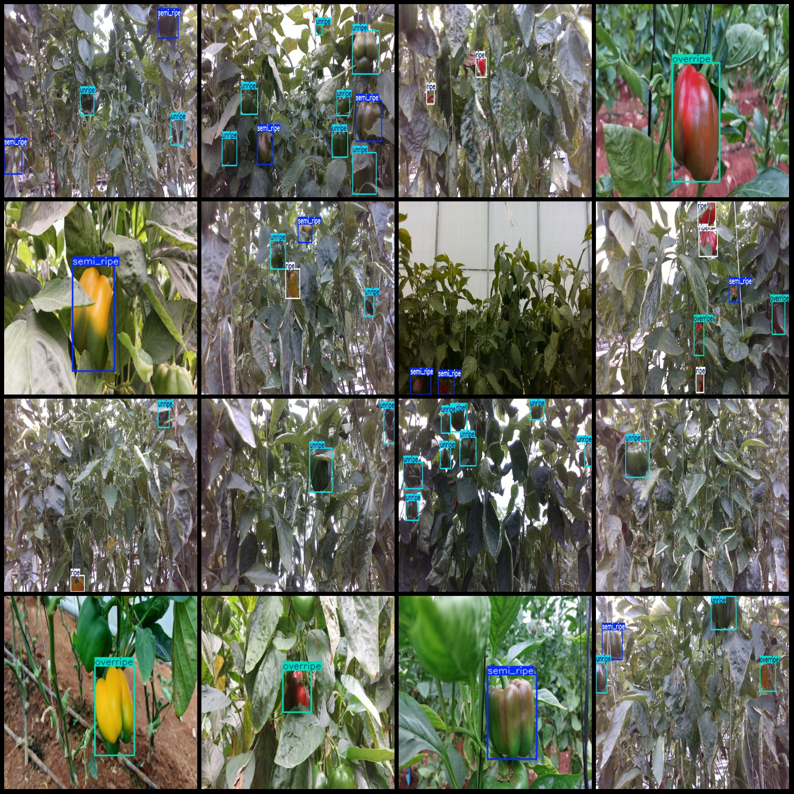
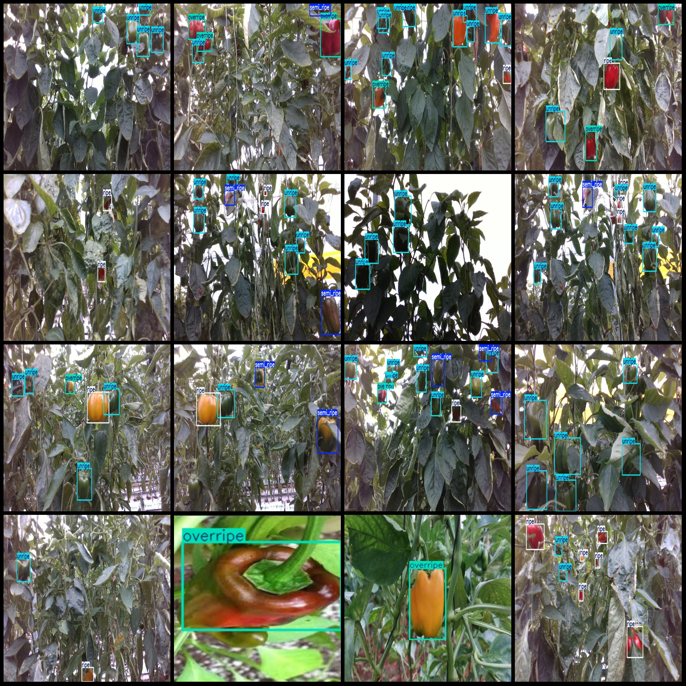

# Smart Agriculture Chili Maturity Detection Dataset VOC+YOLO Format, 1755 Images in 4 Categories

Dataset format: Pascal VOC format + YOLO format (txt file without split path, only containing jpg images and corresponding VOC format xml files and yolo format txt files)
Number of images (jpg file count): 1755
Number of annotations (xml file count): 1755
Number of annotations (txt file count): 1755
Number of annotation categories: 4
Annotation category names (note that the order of classes in the yolo format does not correspond with this, but is based on the labels folder 'classes.txt'): ["overripe", "ripe", "semi_ripe", 
"unripe"]
Number of boxes for each category:
- overripe (overly ripe) = 534
- ripe (ripe) = 1485
- semi_ripe (semi-ripe) = 749
- unripe (underlying) = 3784
Total number of boxes: 6552
Number of images per category:
- overripe (overly ripe) = 430
- ripe (ripe) = 764
- semi_ripe (semi-ripe) = 564
- unripe (underlying) = 1001
Image resolution: Images with multiple resolutions, such as 224×224, 1280×720, etc.
Labeling tool used: labelImg
Annotation rules: Mark boxes for the categories
Important note: The dataset does not include any partitioning of training, validation, or test sets; you will need to do so yourself.
Special declaration: This dataset does not guarantee any accuracy for models trained on it or weight files.
Image preview:
Annotation example:

## Image

Here is a pay link on Stripe ( https://buy.stripe.com/3cs8yP7sY87d0vu9AB ). Please contact me lonlonago@foxmail.com after funding $89, and I will send you a complete data files , thank you!

